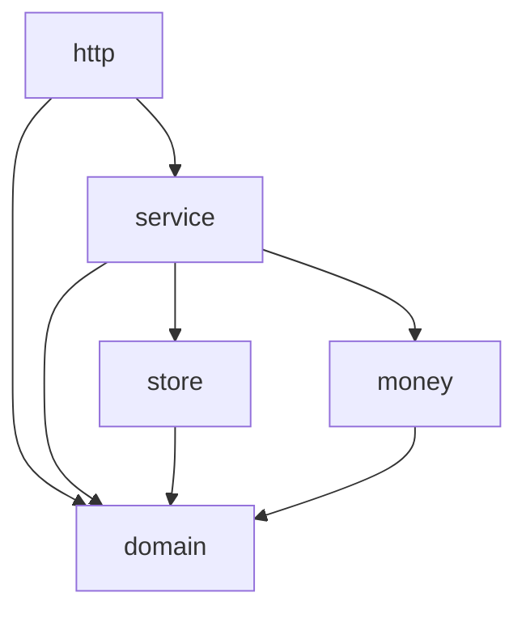
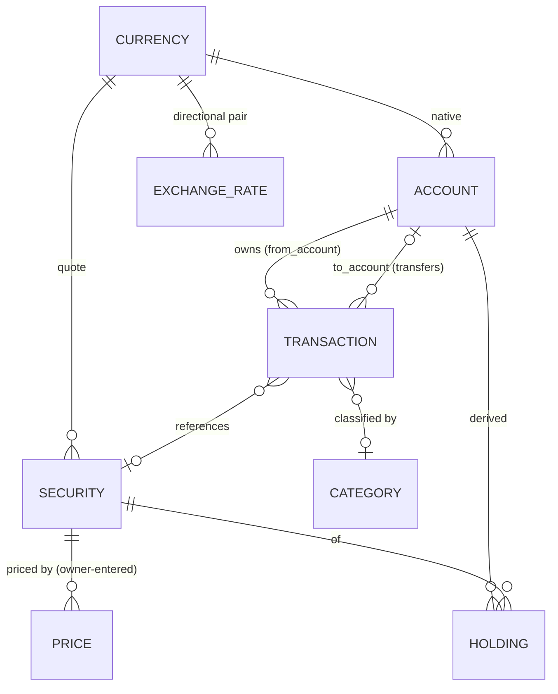

# Architecture Spine — Financas

## Design Paradigm

**Layered "onion"**, four packages with a strict inward dependency rule. The `domain` core (entities + the `Money` type + every derivation) depends on nothing; everything depends inward toward it.

- `http` — chi handlers, templ views, HTMX wiring. Translates requests ↔ service calls and renders. No business logic, no SQL, **no financial arithmetic**.
- `service` — one use-case per operation (record transaction, value portfolio, import file, update price, authenticate). The only place state is mutated; owns DB transactions. Loads authored inputs and calls `domain` for every derived figure.
- `store` — pgx + sqlc-generated queries. Persists and reads; never decides.
- `domain` + `money` — entities, the `Money` (amount + currency) and decimal types, FX conversion, and the single canonical implementation of every derived figure. Pure, no I/O.



## Invariants & Rules

### AD-1 — Layered dependency direction
- **Binds:** all
- **Prevents:** business logic leaking into handlers or SQL; the store reaching "up" into use-cases; cyclic packages.
- **Rule:** dependencies point inward only — `http → service → store`, all → `domain`/`money`, and `domain`/`money` import nothing project-internal. A handler never calls the store directly; the store never imports `service`.

### AD-2 — The transaction ledger is the single source of truth; everything else is derived on read `[ADOPTED]`
- **Binds:** FR-3, FR-4, FR-5, FR-6, FR-10, FR-13
- **Prevents:** two writers disagreeing on a balance; Holdings/realized gain drifting from the events that produced them, or going stale when an antecedent transaction is edited.
- **Rule:** `Transaction` rows are the only authored financial state. `Holding` (quantity, cost basis), account balances, `Valuation`, `Net Worth`, and **realized Gain/Loss** are all **derived on read** — never stored, never independently edited. For a Sell, the cost basis of the shares sold (`basis_sold`) is produced by **one shared pure `domain` function**; `remaining_basis = basis_before − basis_sold` and `realized_gain = proceeds − basis_sold` use that same value, so holding and realized gain reconcile by construction. Correcting a position means editing transactions.

### AD-3 — Single mutation path, one DB transaction per use-case
- **Binds:** FR-1, FR-4, FR-5, FR-6, FR-7, FR-9, FR-13, FR-15
- **Prevents:** partial writes; two code paths mutating the same entity differently.
- **Rule:** all state changes go through a `service` use-case that wraps its writes in a single database transaction. Handlers and stores never mutate financial state outside a service use-case. A failed use-case rolls back whole.

### AD-4 — Money and quantities are decimal, never float `[ADOPTED]`
- **Binds:** all monetary/quantity values (FR-2, FR-4, FR-5, FR-6, FR-9, FR-10)
- **Prevents:** rounding drift that breaks SM-2 (the owner's spot-checks against statements).
- **Rule:** monetary amounts and security quantities use an exact decimal type in code (one shared `Money` = decimal amount + ISO-4217 currency) and `NUMERIC` in PostgreSQL. Floating-point money is forbidden end-to-end, including JSON and templ rendering. Amount columns store **non-negative magnitudes**; direction is a function of `Transaction.type`, never a raw sign.

### AD-5 — Store native currency; convert only at read time
- **Binds:** FR-2, FR-10, FR-11, FR-12
- **Prevents:** two units storing converted vs native values; historical totals silently re-based by today's rate.
- **Rule:** every amount is stored in its own native `Currency`, never pre-converted. Conversion to the **Display Currency** happens only in the `domain` projection layer, using the `ExchangeRate` effective at the relevant date (latest for "now"). Persisted amounts are never overwritten with converted values. Conversion arithmetic is governed by AD-12.

### AD-6 — Prices and FX are owner-entered, effective-dated time series `[ADOPTED]`
- **Binds:** FR-2, FR-9, FR-12
- **Prevents:** an accidental external dependency; ambiguity over "which rate/price applies when."
- **Rule:** `Price` and `ExchangeRate` are append-only, effective-dated rows entered by the owner. There is **no** external/online/real-time market-data or FX client. Reads select the row effective at (≤) the query date. `ExchangeRate` rows are **directional and never inverted in code** — a needed pair with no effective row triggers the FR-2 prompt rather than a `1/rate` guess.

### AD-7 — Single owner, authenticated everywhere `[ADOPTED]`
- **Binds:** FR-14, all data routes
- **Prevents:** any unauthenticated data access; multi-tenant assumptions creeping into the model.
- **Rule:** the app serves exactly one owner. Every non-login route requires an authenticated session; credentials are hashed with **argon2id**. The data model carries no tenant/owner foreign key — single-tenancy is an invariant, not a column. `[ASSUMPTION: cookie-based server session]`

### AD-8 — One container image, deployed to Azure over managed Postgres
- **Binds:** FR-15, operational envelope
- **Prevents:** dev/prod drift; data living somewhere a host loss can destroy.
- **Rule:** the app ships as a single Docker image (server + embedded templ/static assets) run on **Azure Container Apps**, backed by **Azure Database for PostgreSQL Flexible Server**. Config and secrets come from environment only. Local dev mirrors prod via Docker Compose. `[ASSUMPTION: Container Apps over App Service; confirm at deploy]`

### AD-9 — One canonical Transfer storage shape
- **Binds:** FR-6
- **Prevents:** balance derivation silently missing half of every transfer (one-row vs two-row encodings disagreeing).
- **Rule:** a Transfer is **one** `Transaction` row carrying `from_account_id`, `to_account_id`, `from_amount` (source Currency), and `to_amount` (destination Currency). Same-currency ⇒ `from_amount == to_amount`; the transfer-time rate is **not stored** (it is `to_amount / from_amount`). Balance derivation debits `from_account` and credits `to_account` from that single row. A Transfer into a credit Account reduces balance owed; into a cash/investment Account increases its (cash) balance.

### AD-10 — One canonical home per derived figure
- **Binds:** FR-3, FR-4, FR-10, FR-11, FR-12
- **Prevents:** three implementations of "the same number" (in `domain`, `service`, and a templ helper) drifting in rounding/aggregation.
- **Rule:** every derived figure — Holding, balance, Valuation, Net Worth, realized Gain/Loss, allocation — has exactly **one** pure function in `domain`. `service` loads authored inputs (transactions, prices, rates) and calls it; `http` only renders the result. No caller re-derives, re-aggregates, or re-rounds a derived figure.

### AD-11 — Value-over-time is derived from history, not snapshotted
- **Binds:** FR-11, FR-12
- **Prevents:** one unit walking the price/rate history while another writes periodic snapshot rows — two different curves and baselines.
- **Rule:** the value-over-time series is derived from the effective-dated `Price`/`ExchangeRate` history — **no snapshot table** — sampled at each date an input changed. "Period/today's change" baseline = the Portfolio value computed at the prior sample date (shows "—" until a prior sample exists). Never retroactively recomputed at today's rate (consistent with AD-6).

### AD-12 — Conversion & money-rounding policy
- **Binds:** FR-2, FR-10, FR-12
- **Prevents:** divergent totals and allocation percentages from inconsistent rounding mode and aggregation order.
- **Rule:** conversion is a single pure `money.Convert(amount, rate) → amount` using **banker's rounding (half-to-even)**, rounded **once at the display boundary**. Aggregates **convert-then-sum** (each native amount converted, then summed) — the same order everywhere. Allocation percentages are computed from unrounded converted values and reconciled to sum to exactly 100%. **Cumulative** realized Gain/Loss sums each Sell's realized gain converted at the `ExchangeRate` effective on that Sell's date, never re-based at today's rate.

## Consistency Conventions

| Concern | Convention |
| --- | --- |
| Packages / entities | lowercase Go packages; entities singular (`Account`, `Transaction`, `Security`, `Holding`); templ components PascalCase |
| IDs | `bigint` generated-identity primary keys `[ASSUMPTION: bigint over UUID, single-user]` |
| Money / quantity / price | `NUMERIC(19,4)` for money and Price, `NUMERIC(28,10)` for share quantity `[ASSUMPTION: scales]`; `shopspring/decimal` in Go |
| Exchange-rate scale | `NUMERIC(18,8)` — distinct from money scale |
| Average cost | `basis_sold = total_basis × (qty_sold / qty_held)`, rounded to money scale **once at the end**; banker's rounding (half-even); `decimal.DivisionPrecision` set explicitly (e.g. 12) in one shared place; intermediates carry full precision |
| Currency | ISO-4217 3-letter code (`USD`, `BRL`) |
| Dates | calendar dates (transaction/effective dates) as `DATE`; instants as `timestamptz` UTC; two-digit import years pivot 00–69 → 2000s, 70–99 → 1900s |
| Categories | an income-type Category attaches only to Income, an expense-type only to Expense |
| Archived accounts | excluded from **both** Portfolio total and Net Worth in current views; retained for history |
| Import idempotency | duplicate-detection key `(account_id, date, description, value)`; a per-row natural-key hash is stored so re-import is idempotent |
| Export / restore | export contains **authored state only** (accounts, securities, transactions, categories, prices, rates); restore preserves PKs via identity insert (no FK remap); derivations reproduce the rest |
| Errors | `service` returns typed domain errors; `http` maps them to status + an HTMX-friendly partial; no panics across layers |
| Migrations | goose, sequential, forward-only in production |
| CSRF / sessions | Go 1.25+ `http.CrossOriginProtection`; auth middleware guards all non-login routes |

## Stack

<!-- Go 1.26.4 and PostgreSQL 18.4 verified current against release channels, June 2026; web libs are seed — exact minor pinned in go.mod/package.json at scaffold. -->

| Name | Version |
| --- | --- |
| Go | 1.26.4 |
| PostgreSQL | 18.4 |
| chi (router) | v5 |
| pgx (driver) | v5 |
| sqlc (query codegen) | current |
| goose (migrations) | current |
| templ (templating) | current |
| HTMX | 2.x |
| Tailwind CSS | 4.x |
| shopspring/decimal (money) | current |
| Charting (dashboard) | `[ASSUMPTION: a small JS chart lib, e.g. Chart.js, for FR-11/FR-12]` |
| Docker / Azure Container Apps / Azure DB for PostgreSQL | — |

## Structural Seed

```text
financas/
  cmd/server/            # main: config, wiring, http.ListenAndServe
  internal/
    domain/              # entities + ALL derivations (the canonical figures); no project imports
    money/               # decimal Money type, Currency, Convert()
    service/             # use-cases; owns DB transactions (the only mutator)
    store/               # pgx + sqlc-generated queries (db/query/*.sql -> here)
    http/                # chi handlers, middleware (auth, CSRF), templ render
  web/                   # *.templ views, static assets, Tailwind input
  db/
    migrations/          # goose *.sql
    query/               # sqlc source queries
  Dockerfile
  docker-compose.yml     # app + postgres for local dev
```

Core entities (Holding is a derived read model, not an authored table; a Transfer is one row referencing two accounts):



## Capability → Architecture Map

| Capability / Area | Lives in | Governed by |
| --- | --- | --- |
| Accounts, currencies, FX rates (FR-1, FR-2) | `service/account`, `store` | AD-5, AD-6, AD-12 |
| Securities & derived holdings (FR-3, FR-4) | `domain` (canonical derive), called by `service/holding` | AD-2, AD-4, AD-10 |
| Transaction register & transfers (FR-5–FR-8) | `service/transaction`, `http` | AD-2, AD-3, AD-4, AD-9 |
| Prices & valuation, net worth (FR-9, FR-10) | `domain` derivations via `service/valuation`, `money` | AD-2, AD-5, AD-6, AD-10, AD-12 |
| Dashboard, allocation, performance (FR-11, FR-12) | `domain` projections rendered by `http` | AD-10, AD-11, AD-12 |
| File import (FR-13) | `service/import`, `http` | AD-2, AD-3, conventions |
| Auth (FR-14) | `http` middleware + `service/auth` | AD-7 |
| Export / restore (FR-15) | `service/backup` | AD-2, AD-3, AD-8, conventions |

## Deferred

- **Materialize vs compute-on-read for Holdings/Valuations** — default compute-on-read (single-user data volume); revisit only if the dashboard feels slow. The code owns this.
- **Azure service choice** (Container Apps vs App Service) and exact Postgres tier — settle at deploy (AD-8 assumption).
- **Charting library** — pick at dashboard build (FR-11/FR-12).
- **Export bundle format** (SQL dump vs JSON/CSV) — FR-15 detail; the restore ID strategy is already pinned (conventions).
- **Session storage & timeout values** — AD-7 assumption.
